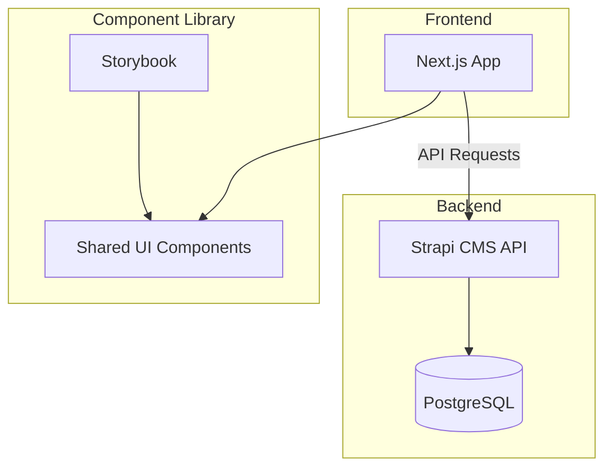

# Fullstack Portfolio CMS

A fullstack monorepo built with **Next.js**, **Strapi**, and a **shared component library** with Storybook. Designed as a personal portfolio and reusable CMS template.

## Tech Stack

- **Frontend**: Next.js 16 (App Router), TypeScript, Tailwind CSS
- **Backend**: Strapi 5 (Headless CMS), PostgreSQL
- **UI Library**: Storybook 10 with reusable components
- **Monorepo**: NX
- **Testing**: Jest, Vitest, Playwright
- **Package Manager**: Bun

## Architecture



## Project Structure

```
apps/
├── frontend/          # Next.js application
├── backend/           # Strapi CMS
libs/
├── shared-ui/         # Component library + Storybook
├── aws/               # AWS CDK infrastructure
├── strapiBackups/     # Strapi backup plugin
├── strapiRevalidate/  # Strapi revalidation plugin
└── strapiSync/        # Strapi sync plugin
```

## Getting Started

### Prerequisites

- Node.js >= 20
- Bun
- PostgreSQL (or Docker)

### Setup

```bash
# Install dependencies
bun install

# Copy environment files
cp apps/frontend/.env.example apps/frontend/.env
cp apps/backend/.env.example apps/backend/.env

# Start development (all apps)
bun run dev

# Or start individually
bun run dev:frontend    # Next.js on :4009
bun run dev:backend     # Strapi on :1337
bun run dev:storybook   # Storybook on :6006
```

## Key Features

- 🧩 **Component Library** — 40+ reusable components with Storybook
- 📝 **CMS-driven content** — All content managed through Strapi
- 🔍 **FAQ System** — Search, category filters, featured slider, URL anchors
- 🎠 **Carousel System** — Drag/swipe on mobile, arrows on desktop
- 📄 **Markdown Processor** — Variant-based rendering (navbar/footer/content)
- 🧪 **Full Test Suite** — Unit, integration, and E2E tests
- 📱 **Responsive** — Mobile-first design
- 🏗️ **NX Monorepo** — Efficient builds with affected detection

## License

MIT
